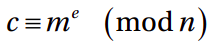
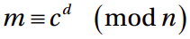
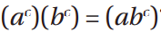
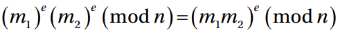
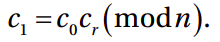
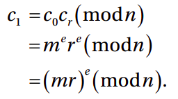

# Asymmetric Encryption: Public/Private Keys

Asymmetric uses two keys: public keys and private keys. Primarily, public keys is used to decrypt messages that only private keys can decrypt.

## Generating Private Keys

Generating keys in RSA is a little bit tricky, as it requires finding two very large integers with a high likelihood of being co-prime.

While either key can be used to encrypt only the private key can be used to decrypt

```python
from cryptography.hazmat.backends import default_backend
from cryptography.hazmat.primitives.asymmetric import rsa
from cryptography.hazmat.primitives import serialization

# Step 1 - Generate a private key. (will be large integer)
private_key = rsa.generate_private_key(
    public_exponent=65537,
    key_size=2048,
    backend=default_backend()
)

# Step2 - Extract the public key from the private key. (will be large integer)
public_key = private_key.public_key()

# Step3 - Convert the private key into bytes. We won't encrypt it this time.
private_key_bytes = private_key.private_bytes(
    encoding=serialization.Encoding.PEM,
    format=serialization.PrivateFormat.TraditionalOpenSSL,
    encryption_algorithm=serialization.NoEncryption()
)

# Step4 - Convert the public key into bytes.
public_key_bytes = public_key.public_bytes(
    encoding=serialization.Encoding.PEM,
    format=serialization.PublicFormat.SubjectPublicKeyInfo
)

# Step5 - Convert the private key bytes back to a key.
# Because there is no encryption of the key, there is no password.
private_key = serialization.load_pem_private_key(
    private_key_bytes,
    backend=default_backend(),
    password=None
)

# Step5 - Convert the public key bytes back to a key.
public_key = serialization.load_pem_public_key(
    public_key_bytes,
    backend=default_backend()
)

```

*The private_bytes and public_bytes methods convert large integer keys into bytes that are in a standard network- and disk-ready encoding called a PEM. The corresponding serialization “load” methods can be used to decode these after reading those bytes from disk so that they look like keys again to the encryption and decryption algorithms.*

*It is possible (and a very good idea) to encrypt the private key itself, but we opted not to do that here, which is why no password is used.*
\
 *Encryption*
\
 *Decryption*

### RSA Done Wrong: Part One

Using RSA without padding is especially unsafe and insecure for numerous reasons,

### More on asymmetric encryption

Exactly what can be done with the key pair depends on the algorithm.Typically, either key can act in either role: a private key can encrypt messages that can be decrypted by the public key and vice versa. With RSA, of course, one key is clearly the private key because the public key can be derived from the private key, but not the other way around.

Asymmetric encryption can be used for two purposes:

1. **Cryptographic dropbox:** Anyone with the public key can encrypt a message and send it to the owner of the private key. Only someone with the private key can decrypt the message.
2. Signatures: Anyone with the public key can decrypt a message encrypted by the private key. This obviously is not helpful for confidentiality (anyone can decrypt the message) but it helps to prove the identity of the sender.

**Note:** RSA Encrypts Small Things The cryptographic dropbox operation we are learning about right now is almost never used to send complete messages in this way. The most common way RSA encryption was used (again, it is being phased out) was to encrypt a symmetric  key for transport from one party to another.

### Ways asymmetric can be tempered with

1. Eve can replace public keys sent by Alice with hers. This way the can decrypt all messages sent by Alice.
2. Eve can deceive Bob by sending messages encrypted by them instead of Alice.

### Some problems that rise if RSA is not used with padding

1. Deterministic Outputs:

### Chosen Ciphertext Attack (CCA)

This type of attack works when you can get the victim to decrypt some ciphertexts of your choosing on your behalf.

*Note:* **Encryption Homomorphism** is the concept that a computation performed on the ciphertexts reflects on the plaintext. Not all Not all crypto systems have homomorphic properties, but RSA does to some extent. This allows third parties to provide services on data without being able to read it.
\

\

\
*Restated another way, the product of two ciphertexts (encrypted under the same ublic key) decrypts to the product of the two plaintexts.*

#### How Encryption Homomorphism can be used for CCA

For our example, let’s choose our multiple to just be 2. Eve starts by encrypting 2 using (4.1) and the public key to get cr.For clarity, let’s call the original ciphertext c0. If we multiply c0 and cr (modulo n), we’ll get a new ciphertext that we’ll call c1.

\

\

\
C1 will will be sent to Bob for encryption which will return (mr). Bob will see it as gibberish. But if Eve gets it, She can divide it by her (r) to get (m) (Done in modular arithmetic).  Inverse operation: r−1 (mod n).
\
`r_inv_modulo_n = gmpy2.powmod(r, -1, n)`

See: exe4.8.py

### Common Modulus Attack

if the same RSA message is encrypted by two different public keys with the same n modulus, the message can be decrypted without the private key. Recall that the n parameter is the modulus and is included in both the public key and private key. It is true that a new private key/public key pair will allow Eve to decrypt any messages Alice sends in the future. But the common modulus attack will allow Eve to potentially determine some messages sent in the past.

### The Proof Is in the Padding

There are two critical problems with textbook RSA (without paddding).

1. The outputs are deterministic.
2. Malleable messages

*To reduce or eliminate these problems, practical uses of RSA always utilizes padding with random elements.*

There are two padding schemes that are typically used.

1. The older scheme is called **PKCS #1 v1.5**  (Obsolute)
2. The other is **OAEP** Optimal Asymmetric Encryption Padding (**Recommended)**

Encrypting with padding example

```python

  
from cryptography.hazmat.backends import default_backend
from cryptography.hazmat.primitives.asymmetric import rsa
from cryptography.hazmat.primitives import serialization
from cryptography.hazmat.primitives import hashes
from cryptography.hazmat.primitives.asymmetric import padding


message = b'test'

# Step 1- Generate private key and public key
private_key = rsa.generate_private_key(
      public_exponent=65537,
      key_size=2048,
      backend=default_backend()
  )
public_key = private_key.public_key()

# Step 2 - encrypt with public key and padding
ciphertext1 = public_key.encrypt(
    message,
    padding.OAEP(
        mgf=padding.MGF1(algorithm=hashes.SHA256()),
        algorithm=hashes.SHA256(),
        label=None # rarely used. Just leave it 'None'
    )
)

###
# WARNING: PKCS #1 v1.5 is obsolete and has vulnerabilities
# DO NOT USE EXCEPT WITH LEGACY PROTOCOLS
ciphertext2 = public_key.encrypt(
    message,
    padding.PKCS1v15()
)

# Step 2 - Decrypt with private key and padding
recovered1 = private_key.decrypt(
ciphertext1,
 padding.OAEP(
     mgf=padding.MGF1(algorithm=hashes.SHA256()),
     algorithm=hashes.SHA256(),
     label=None # rarely used. Just leave it 'None'
 ))
   
recovered2 = private_key.decrypt(
ciphertext2,
 padding.PKCS1v15()
)

print("Plaintext: {}".format(message))
print("Ciphertext with PKCS #1 v1.5 padding (hexlified): {}".format(ciphertext1.hex()))
print("Ciphertext with OAEP padding (hexlified): {}".format(ciphertext2.hex()))
print("Recovered 1: {}".format(recovered1))
print("Recovered 2: {}".format(recovered2))
if ciphertext1 != ciphertext2 and recovered1 == message and recovered2 == message:
    print("[PASS]")

```

Padding solves the following problems

1. Deterministic ouput
2. Solves CCA, CMA
3. Padding also solves the problem of losing leading zeros during encryption